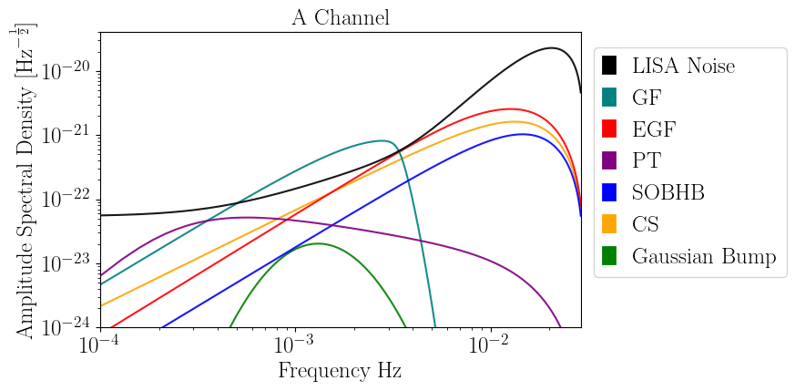

# BAHAMAS

[](https://github.com/fede121/bahamas/actions/workflows/paper.yml) [](https://github.com/fede121/bahamas/actions/workflows/testing.yml)
[](https://github.com/fede121/bahamas/actions/workflows/docs.yml)
[](https://doi.org/10.5281/zenodo.16087704)

**Bahamas: BAyesian inference with HAmiltonian Montecarlo for Astrophysical Stochastic background.**

BAHAMAS is a Python package for the inference of stochastic gravitational wave background signals (SGWB) using Hamiltonian Markov Chain Monte Carlo (HMCMC) as implemented in [NumPyro](https://num.pyro.ai/en/stable/getting_started.html#what-is-numpyro), which relies on JAX for automatic differentiation and JIT compilation to GPU/CPU.  
BAHAMAS is under active development, so be aware of potential brittleness, bugs, and changes to the API as the design evolves.
Documentation available at: [Bahamas docs](https://federicopozzoli.github.io/bahamas/)

## Features

The package includes two main command-line interfaces:

  - `bahamas_data`: Data simulation and preprocessing. 

  - `bahamas_inference`: Parameter estimation and minimal diagnostics

  - `bahamas_input`: From LISA data challange dataset (e.g. yorsh) to bahamas

Both scripts require two input files:

  - `--config config.yaml`: Specifies the simulation and inference settings, sampler configuration, and output paths.

  - `--sources sources.yaml`: Defines the sources to be injected and/or recovered. This includes the true physical parameters of the sources as well as the prior ranges used for inference.

The data consist of two datastreams—the A and E channels—which are specific combinations of Time-Delay Interferometry ([TDI](https://ui.adsabs.harvard.edu/abs/2021LRR....24....1T/abstract)) variables. In `bahamas`, the data are generated in the frequency domain, chunk by chunk. This represents a simplification, as it neglects potential biases arising in the time domain, such as windowing effects and spectral leakage.  The duration of each chunk—and consequently the frequency resolution—can be configured via config.yaml. However, we recommend not using time lengths shorter than $10^4 \mathrm{s}$, which corresponds to a frequency resolution of approximately $\Delta f \sim 0.1 \mathrm{mHz}$, below which the characterization of LISA's instrumental noise is not guaranteed.  

The algorithm also allows for the analysis of stationary, isotropic, and Gaussian stochastic process (e.g., a signal characterized by a power-law power spectral density), enabling the evaluation of the impact of multiple overlapping sources.

We also provide the option to include data gaps, which represent periods during the mission when no useful data are available. These gaps can occur due to scheduled maintenance (scheduled gaps) or unforeseen hardware issues (unscheduled gaps). The goal is not to mitigate the impact of these interruptions but rather to characterize their effect on the reconstruction of stochastic signals.

The algorithm provides flexibility to perform analyses with either full-resolution data or coarse-grained data over different chunks. In the former case, the likelihood describing the data follows a [Whittle](https://api.semanticscholar.org/CorpusID:125739077) distribution in each segment, while in the latter, it collapses to a [Gamma](https://www.aanda.org/articles/aa/pdf/2003/49/aa0401.pdf) distribution with degrees of freedom equal to the number of bins used in the averaging process.

## Sources

This plot shows the types of signals you can simulate using `bahamas`. The galactic foreground can be generated and analyzed in both stationary and non-stationary assumption.



## Notebooks
In the `data` folder, you can find two example notebooks:

- `example_bahamas`: A minimal example demonstrating how to use bahamas.

- `example_modulation`: This notebook shows how the modulation model implemented in bahamas accounts for the non-stationarity of the galactic foreground. Feel free to play with the parameters and observe how the modulation changes!

## Installation

You can install BAHAMAS from source:

```bash
git clone https://github.com/fede121/bahamas.git
cd bahamas
pip install .
```

## License

This project is open-source and available under the [Apache License 2.0](https://www.apache.org/licenses/LICENSE-2.0).

---

For more information, examples, or to contribute, please visit the [GitHub repository](https://github.com/FedericoPozzoli/bahamas.git).
